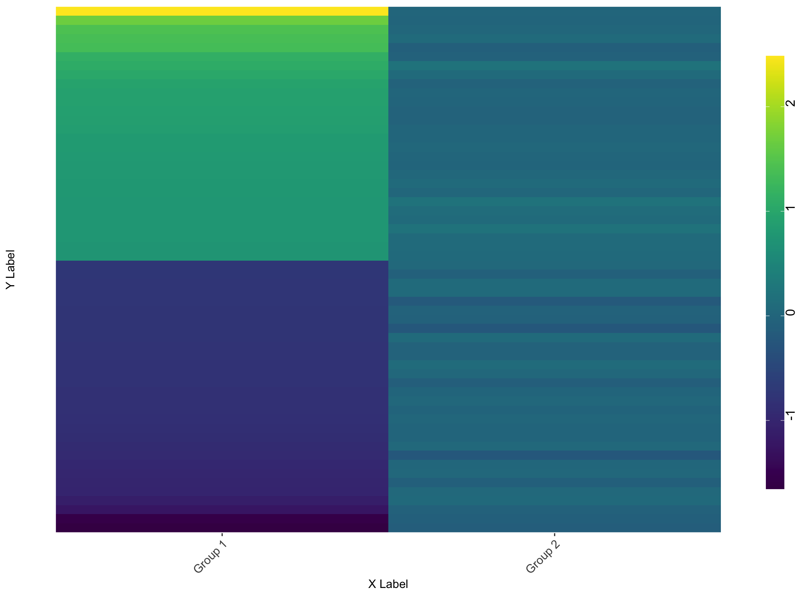

# Table of Contents
1. [Differential Gene Expression Heatmap](#differential-gene-expression-heatmap)
2. [Prerequisites](#prerequisites)
3. [Important Notes](#important-notes)
4. [Usage](#usage)
5. [Output](#output)

# Differential Gene Expression Heatmap 
This repository contains an R script for quickly creating a customizable heatmap for comparing differential gene expression (DGE) data between two groups. The heatmap provides a visually appealing and intuitive representation of the data, making it easier to identify trends in differential expression between two groups.

## Prerequisites 
Before running the pipeline, please make sure you have the following R packages installed:

* `tidyverse`
* `dplyr`
* `ggplot2`
* `scales`
* `viridis`

## Important Notes 
The first dataset/group listed in the script will be used as the "reference" group. It will appear on the left side of the heatmap, arranged in order of differential expression, and will be filtered based on the expression difference cutoff specified. Please keep this in mind when configuring the script and inputting your data.

Additionally, please ensure that both of your DGE datasets contain identical gene IDs. Depending on the initial parameters of the DGE method used (e.g., edgeR, DESeq2, etc.), the output results may only include the most differentially expressed genes, not all analyzed genes. Mismatched gene IDs between the datasets could lead to blank rows appearing in your heatmap. For instance, if you filter group 1's logFC by 0.75 and some of those genes are not present in group 2's dataset, there will be empty spaces on the right side of the heatmap.

## Usage 
1. Open the main R script in your working directory.
2. Load the required libraries.
3. Configure the parameters at the beginning of the script. Set the static variables, such as the data directories, group names, column names, and labels.
4. Run the script to generate the heatmap.
5. Review your results and I hope you learn something new!

## Output 
The script generates a heatmap that looks like this:

